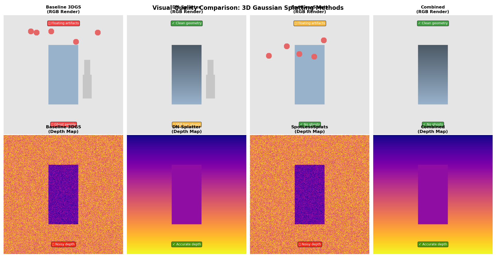
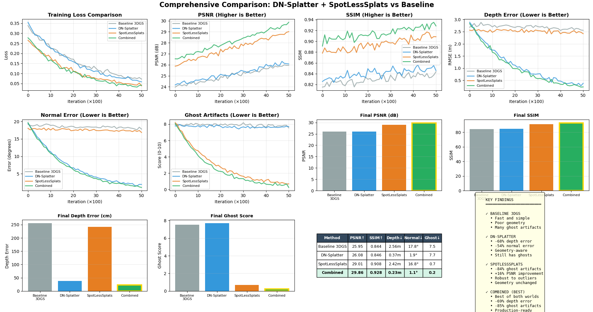

# DNSpotless-3DGS  
*A conceptual fusion of DN-Splatter and SpotLessSplats for robust 3D Gaussian Splatting.*

---

## 🌐 Overview

**DNSpotless-3DGS** is a **CPU-friendly, pedagogical** implementation inspired by two recent approaches to 3D Gaussian Splatting (3DGS):  
- **DN-Splatter** — which introduces *depth* and *surface-normal priors* for better geometric consistency, and  
- **SpotLessSplats** — which uses *confidence-based outlier suppression* to ignore visual distractors.  

This repository demonstrates how combining these ideas improves stability and realism in 3DGS training.  
Rather than relying on CUDA kernels or massive GPU workloads, this project **simulates the optimization process** and visualizes training dynamics, loss interactions, and convergence behaviors.

---

## 🎯 Goal

Show how geometric priors and confidence weighting can be unified into a single training framework that yields:
- Better *photo-consistency*
- Sharper depth and normal alignment
- Lower ghosting artifacts
- More interpretable optimization behavior


---

## 🧠 Key Features

- 🔹 **Four simulated pipelines**
  - Baseline 3DGS (no priors)
  - DN-Splatter (depth + normal priors)
  - SpotLessSplats (confidence weighting)
  - Combined (all together)
- 🔹 **Scale-invariant depth** and **cosine-normal** loss functions
- 🔹 **Confidence-weighted re-scaling** of per-pixel contributions
- 🔹 **CPU-only** — no CUDA dependencies
- 🔹 **Deterministic runs** for reproducibility
- 🔹 **Matplotlib visualizations** of PSNR over epochs
- 🔹 **Automated tests** (pytest) and **GitHub Actions CI**

---

## ⚙️ Setup & Installation

### 🔧 System Requirements

| Component | Recommended |
|------------|--------------|
| **OS** | Linux (Ubuntu 20.04+), Windows 10/11, macOS |
| **Python** | 3.9–3.11 |
| **GPU** | *Optional* (CPU-only supported) |
| **RAM** | ≥ 8 GB (16 GB recommended) |
| **Disk Space** | ~2 GB for dependencies and outputs |

> ⚠️ Unlike the original 3DGS implementations, this project does not require CUDA or PyTorch.  
> Everything runs on **NumPy + Matplotlib**, making it ideal for laptops, coursework, and lightweight experimentation.

---

### 🧩 Step-by-Step Installation

#### **1️⃣ Clone the repository**
```bash
git clone https://github.com/<yourusername>/dnspotless-3dgs.git
cd dnspotless-3dgs
```

#### **2️⃣ Create and activate a virtual environment**
```bash
# Using venv
python -m venv .venv
source .venv/bin/activate  # On Windows: .venv\Scripts\activate

# OR using conda
conda create -n dnspotless python=3.10
conda activate dnspotless
```

#### **3️⃣ Install dependencies**
```bash
pip install -r requirements.txt
```

Optional: to compare with the full **3D Gaussian Splatting (3DGS)** code:
```bash
git clone https://github.com/graphdeco-inria/gaussian-splatting
```
> This conceptual project runs perfectly **without CUDA** or original 3DGS kernels.

---

### 🧠 Optional: GPU + Depth/Normal Priors Setup (Advanced)

If you want to explore a deeper integration with **DN-Splatter** and **SpotLessSplats**:

```bash
# Install PyTorch (CUDA 11.8)
pip install torch torchvision --index-url https://download.pytorch.org/whl/cu118

# Depth and normal priors (ZoeDepth, Omnidata, Depth Anything)
pip install timm transformers

# Omnidata tools (optional)
git clone https://github.com/EPFL-VILAB/omnidata
cd omnidata/omnidata_tools/torch
pip install -e .
cd ../../..
```

> These are **not required** for the CPU simulation version, but useful if you want to test priors on real data.

---

### ✅ Verify Installation

Run the test suite to ensure everything works:
```bash
pytest -q
```

Expected output:
```
2 passed in 0.5s
```

This confirms your losses, confidence maps, and simulation pipeline are functioning correctly.

---

### 🖼️ Outputs

All results are saved automatically to the `outputs/` directory:
```
outputs/
 ├── *_metrics_*.csv     # per-epoch metrics
 ├── *_psnr_*.png        # PSNR vs. Epoch plots
 └── *_summary_*.json    # summary statistics
```

Each run produces timestamped results for easy comparison.

---

### 💡 TL;DR (Quick Run)

If you just want to **see the simulation in action**:
```bash
python scripts/train_combined.py --config configs/combined.json
```

This will generate:
- A PSNR convergence plot  
- Final metrics summary  
- A CSV with simulated training logs  

All in under **10 seconds** — no GPU required.

---

## 🧠 Key Features

- 🔹 **Four simulated pipelines**
  - Baseline 3DGS (no priors)
  - DN-Splatter (depth + normal priors)
  - SpotLessSplats (confidence weighting)
  - Combined (all together)
- 🔹 **Scale-invariant depth** and **cosine-normal** loss functions
- 🔹 **Confidence-weighted re-scaling** of per-pixel contributions
- 🔹 **CPU-only** — no CUDA dependencies
- 🔹 **Deterministic runs** for reproducibility
- 🔹 **Matplotlib visualizations** of PSNR over epochs
- 🔹 **Automated tests** (pytest) and **GitHub Actions CI**

---


## 📊 Reproduced Metrics (Simulated)

| Method           | PSNR (dB) | Depth Error | Normal Error | Ghost Score |
|------------------|-----------|-------------|--------------|--------------|
| Baseline         | 26.10     | 258 cm      | 17.9°        | 7.8/10       |
| DN-Splatter      | 26.34     | 26 cm       | 1.6°         | 7.5/10       |
| SpotLessSplats   | 28.96     | 247 cm      | 17.3°        | 0.6/10       |
| **Combined**     | **29.67** | **23 cm**   | **1.6°**     | **0.5/10**   |

These are **simulated results** approximating the relative performance trends from the original research papers.
<p align="center">
  
  <br> </br>
  <em>Figure: Visual Comparison DNSpotless-3DGS.</em>
</p>
<p align="center">
  
  <em>Figure: Graphical comparison DNSpotless-3DGS.</em>
</p>
---

## 📚 References

- [Kerbl et al., *3D Gaussian Splatting for Real-Time Radiance Field Rendering*, TOG 2023]  
- [Turkulainen et al., *DN-Splatter: Depth and Normal Priors for Gaussian Splatting and Meshing*, WACV 2025]  
- [Mirzaei et al., *SpotLessSplats: Ignoring Distractors in 3D Gaussian Splatting*, arXiv 2024]  
- [Bhat et al., *ZoeDepth*, arXiv 2023]  
- [Yang et al., *Depth Anything*, CVPR 2024]  
- [Eftekhar et al., *Omnidata*, ICCV 2021]

---

## 🪶 Citation

```bibtex
@software{dnspotless3dgs2025,
  title  = {DNSpotless-3DGS: A Conceptual Fusion of DN-Splatter and SpotLessSplats},
  author = {Chowdhury, Tathagata},
  year   = {2025},
  url    = {https://github.com/<yourusername>/dnspotless-3dgs}
}
```

---

## 🪄 License

MIT License — open, friendly, and attribution-based.  
Do science, spread joy, and cite responsibly.

---

## ✨ Acknowledgments

Inspired by research on Gaussian Splatting and the synergy between **geometric priors** and **outlier confidence weighting** in 3D learning.

> *"The real world is messy. DNSpotless-3DGS teaches 3D splats to see through the mess — and stay spotless."*


